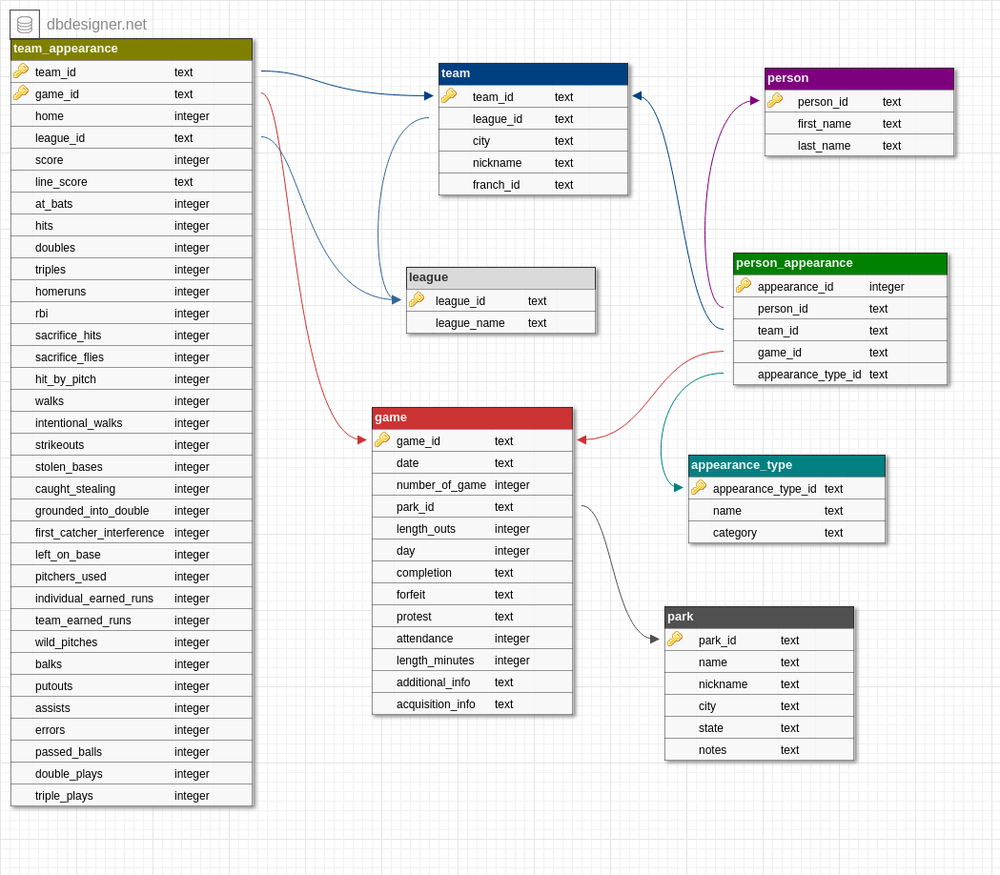

# Designing a Major League Baseball Database

This repository contains a project of designing a database with an MLB dataset from [Retrosheet](http://www.retrosheet.org/)--located in the data zip file. Below is the database image I have designed using [DBDesigner](https://dbdesigner.net/):  